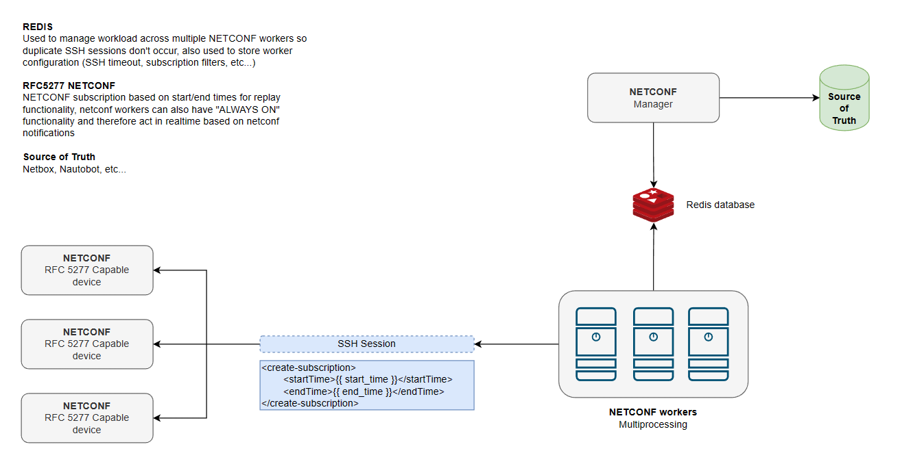

# netzeus-netconf-monitoring
Monitoring NETCONF RFC5277 capable devices using NETCONF events/subscription based checks.

This tool tries to implement NETCONF Event Notifications using ncclient, using a manager to control the workload across multiple "NETCONF workers" which establish the SSH sessions to the devices pulled from a sourth of truth, either periodically (utilizing the replay feature with startTime and endTime) or using an "always-on" type of SSH session to allow real-time event notifications to be picked up and instantly sent to a 3rd party system like Redis or a messaging queuing system like RabbitMQ.

